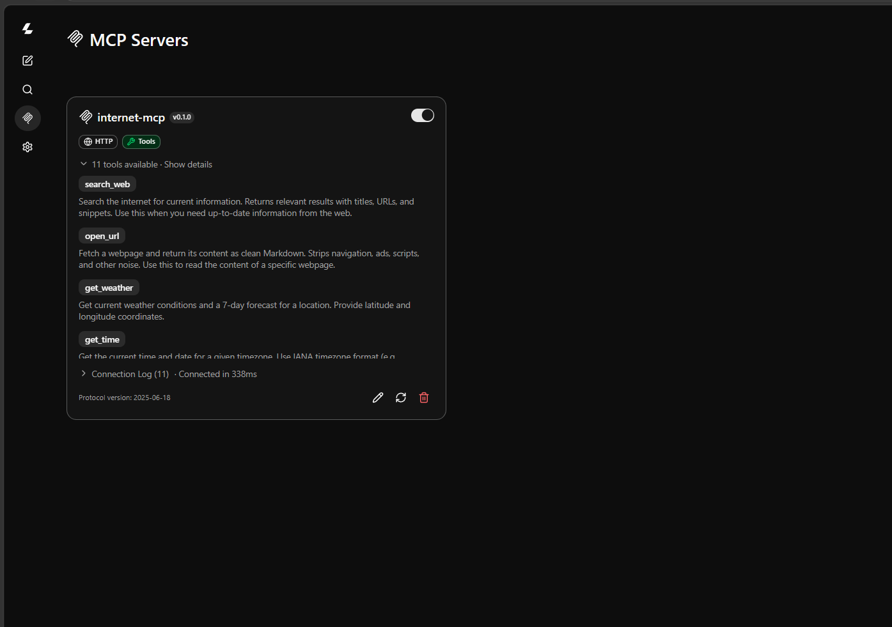

# Internet MCP

A production-grade MCP server that brings real-world capabilities to local LLMs.

Internet MCP enables local AI models such as **Qwen**, **Llama**, **DeepSeek**, **Gemma**, and **Mistral** to access reliable, up-to-date information from the web through a simple, intelligent, and model-friendly interface.

Unlike typical MCP servers that expose many low-level tools, Internet MCP focuses on providing a **small set of high-quality tools** while handling all retrieval complexity internally. The LLM expresses **what it wants**, and the server decides **how to retrieve it**.


## Features

### Tools (11)

-  **`search_web`** — Search the internet for current information
-  **`open_url`** — Fetch any webpage and return clean Markdown
-  **`get_weather`** — Current weather for any location
-  **`get_time`** — Current time in any IANA timezone
-  **`convert_currency`** — Real-time currency conversion
-  **`geocode`** — Forward and reverse geocoding
-  **`get_current_location`** — IP-based geolocation (city, country, coordinates)
-  **`get_crypto_price`** — Cryptocurrency prices
-  **`get_stock_price`** — Stock market prices
-  **`read_rss`** — Read RSS/Atom feeds
-  **`wikipedia`** — Search and read Wikipedia articles

### Infrastructure

-  **Smart caching** — Per-content-type TTLs (search, pages, docs, PDFs)
-  **Pluggable providers** — SearXNG now, Brave/Tavily later
-  **Dual transport** — Stdio (local) + Streamable HTTP (remote)
-  **Production architecture** — DI, typed errors, structured logging

## Quick Start

### Prerequisites

- Node.js 20+
- A [SearXNG](https://docs.searxng.org/) instance (self-hosted or public)

### Run via Docker (Standalone / No Cloning Required)

If you have Docker installed and don't want to clone the repository or install Node.js dependencies, you can start the server immediately using pre-built images:

```bash
# Linux / macOS / Git Bash
curl -O https://raw.githubusercontent.com/Rishon-MM/Internet-MCP/main/docker-compose.prod.yml

# Windows (PowerShell)
Invoke-WebRequest -Uri "https://raw.githubusercontent.com/Rishon-MM/Internet-MCP/main/docker-compose.prod.yml" -OutFile "docker-compose.prod.yml"

# Start the server and SearXNG
docker compose -f docker-compose.prod.yml up -d

# Stop the server and SearXNG
docker compose -f docker-compose.prod.yml down
```


### Install (Local Development / From Source)

```bash
git clone https://github.com/Rishon-MM/Internet-MCP.git
cd internet-mcp
npm install
cp .env.example .env
# Edit .env with your SearXNG URL
```

### Run (Stdio — for Claude Desktop, Open WebUI, VS Code)

```bash
npm run build
npm start
```

### Run (HTTP — for remote access)

```bash
npm run build
TRANSPORT=http npm start
# Server at http://localhost:3000/mcp
# Health check at http://localhost:3000/health
```

### Development

```bash
npm run dev    # Watch mode with hot reload
npm test       # Run tests
npm run lint   # Type check
```

## Configuration

All configuration via environment variables. See [`.env.example`](.env.example) for the full reference.

| Variable | Default | Description |
|---|---|---|
| `SEARCH_PROVIDER` | `searxng` | Active search provider |
| `SEARXNG_BASE_URL` | `http://localhost:8080` | SearXNG instance URL |
| `SEARXNG_TIMEOUT` | `5000` | SearXNG request timeout (ms) |
| `SEARXNG_SAFE_SEARCH` | `0` | Safe search level (0-2) |
| `SEARCH_CACHE_TTL` | `300` | Search results cache TTL (seconds) |
| `PAGE_CACHE_TTL` | `86400` | Web page cache TTL (seconds) |
| `DOC_CACHE_TTL` | `86400` | Document cache TTL (seconds) |
| `PDF_CACHE_TTL` | `2592000` | PDF cache TTL (seconds) |
| `TRANSPORT` | `stdio` | Transport type: `stdio` or `http` |
| `HTTP_PORT` | `3000` | HTTP server port |
| `LOG_LEVEL` | `info` | Log level |

## Tools

### `search_web`

Search the internet for current information.

```json
{
  "query": "latest MCP specification"
}
```

Returns formatted Markdown with ranked search results including titles, URLs, and snippets.

### `open_url`

Fetch a webpage and return clean Markdown.

```json
{
  "url": "https://modelcontextprotocol.io/specification/latest"
}
```

Returns the page content as clean Markdown with navigation, ads, and scripts stripped.

### `get_weather`

Get current weather conditions for any location.

```json
{
  "location": "London"
}
```

### `get_time`

Get the current time and date in any IANA timezone.

```json
{
  "timezone": "America/New_York"
}
```

### `convert_currency`

Convert between currencies at real-time exchange rates.

```json
{
  "from": "USD",
  "to": "EUR",
  "amount": 100
}
```

### `geocode`

Forward geocoding (address → coordinates) or reverse geocoding (coordinates → address).

```json
{
  "query": "Eiffel Tower"
}
```

### `get_current_location`

Get the current geographic location. No input required.

```json
{}
```

Uses a multi-strategy approach:
1. **Windows Location Services** (GPS, Wi-Fi, Bluetooth) — high accuracy, includes precision in meters
2. **IP Geolocation** ([ipwho.is](https://ipwho.is)) — automatic fallback when Windows location is unavailable

The result includes a `source` field (`"windows"` or `"ip"`) so the LLM knows the reliability of the data. When Windows coordinates are obtained, they are reverse-geocoded via [Nominatim](https://nominatim.openstreetmap.org) for a human-readable address.

### `get_crypto_price`

Get current cryptocurrency prices.

```json
{
  "coin": "bitcoin"
}
```

### `get_stock_price`

Get current stock market prices.

```json
{
  "symbol": "AAPL"
}
```

### `read_rss`

Read and parse RSS/Atom feeds.

```json
{
  "url": "https://hnrss.org/frontpage"
}
```

### `wikipedia`

Search and read Wikipedia articles.

```json
{
  "query": "Model Context Protocol"
}
```

## Architecture

```
src/
├── index.ts              # Composition root (DI wiring)
├── mcp/                  # MCP protocol layer (thin)
│   ├── server.ts         # Server + transport setup
│   ├── registry.ts       # Tool registration
│   └── tools/            # Tool definitions (11 tools)
├── core/                 # Business logic
│   ├── retrieval/        # Search + fetch services
│   │   ├── search/       # Search service
│   │   ├── fetch/        # Fetch + extraction service
│   │   ├── extract/      # HTML → Markdown extractors
│   │   └── cache/        # In-memory LRU cache
│   └── connectors/       # External data connectors
│       ├── weather/      # Open-Meteo
│       ├── time/         # Node.js Intl API
│       ├── currency/     # Exchange rates
│       ├── geocode/      # Nominatim (OpenStreetMap)
│       ├── location/     # ipwho.is (IP geolocation)
│       ├── crypto/       # CoinGecko
│       ├── stocks/       # Stock prices
│       ├── rss/          # RSS/Atom feeds
│       └── wikipedia/    # Wikipedia API
├── providers/            # External service adapters
│   └── searxng/          # SearXNG provider
└── shared/               # Config, logger, errors, types
```

**Key design principle:** The MCP layer is a thin shell. All business logic lives in `core/`. Providers are pluggable behind a single interface.

See [docs/architecture.md](docs/architecture.md) for the full architecture documentation.

## Docker

### 1. Local Build (From Source)

If you have cloned the repository and want to build the Docker image locally from source:

```bash
# Build and start Internet MCP + SearXNG
docker compose up -d

# Internet MCP: http://localhost:3000/mcp
# SearXNG:      http://localhost:8080
```

## Client Configuration

### Claude Desktop

Add to your Claude Desktop config (`claude_desktop_config.json`):

```json
{
  "mcpServers": {
    "internet-mcp": {
      "command": "node",
      "args": ["/path/to/internet-mcp/dist/index.js"],
      "env": {
        "SEARXNG_BASE_URL": "http://localhost:8080"
      }
    }
  }
}
```

### Open WebUI / VS Code / Continue

Configure as an MCP server with stdio transport pointing to `dist/index.js`.

## Contributing

See extension guidelines.

To add a new search provider:

1. Implement the `SearchProvider` interface from `src/core/search/search.types.ts`
2. Register it in `src/providers/provider.ts`
3. Add configuration to `src/shared/config.ts`

### Tool Guidelines
**Important:** When adding new tools, follow this core principle:
- The **LLM** is responsible for reasoning, formatting, and analyzing data.
- The **Tool** (Retrieval engine / Connector) is responsible for executing the request and returning **Relevant**, **Unfiltered**, **Raw** data back. 

## License
This project is open-source and available under the [MIT License](LICENSE).