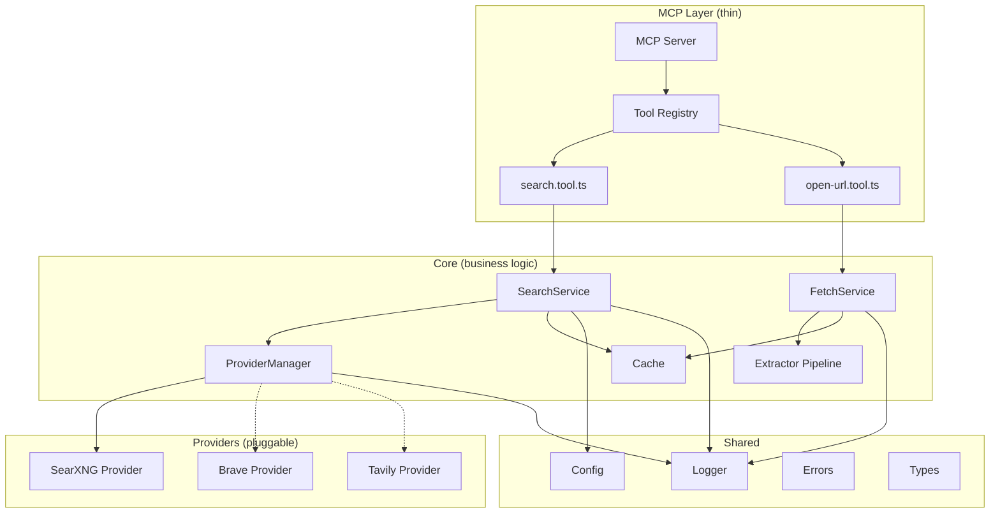

# Internet MCP — Implementation Plan

Build a production-grade MCP server that gives local LLMs reliable, intelligent internet access.

## Technology Stack

| Concern | Choice | Rationale |
|---|---|---|
| **Runtime** | Node.js 20+ | LTS, stable, wide MCP ecosystem support |
| **Language** | TypeScript 5.x (strict mode) | Strong typing, no `any` |
| **MCP SDK** | `@modelcontextprotocol/sdk` v1.29 (stable) | v2 is in beta (ships July 28 2026) — we use v1.x for production stability and will migrate when v2 goes stable |
| **Schema validation** | `zod` v3 | Required by MCP SDK v1.x |
| **Logging** | `pino` (stderr target) | Structured JSON, high perf, MCP-safe (never pollutes stdout) |
| **HTTP client** | Native `fetch` (Node 20+) | Zero dependencies for HTTP |
| **HTML extraction** | `jsdom` + `turndown` | Readability-style parsing → clean Markdown |
| **Testing** | `vitest` | Fast, TypeScript-native, ESM-first |
| **Build** | `tsup` | Zero-config bundling for TypeScript |
| **Package manager** | `npm` | Widest compatibility |

> [!IMPORTANT]
> The MCP SDK v2 (`@modelcontextprotocol/server`) is in beta and ships July 28. We start with the **stable v1.x SDK** (`@modelcontextprotocol/sdk`) and plan a clean migration path. The architecture is designed so the MCP layer is thin — migration will only touch `src/mcp/`.

---

## Architecture Overview



**Key design principle**: The MCP layer is a thin shell. All business logic lives in `core/`. Providers are pluggable behind a single interface. The same core services can be reused from REST, CLI, or SDK without changing business logic.

---

## Open Questions

> [!IMPORTANT]
> **SearXNG Instance**: Do you have a self-hosted SearXNG instance URL, or should we default to a configurable URL via environment variable (e.g., `SEARXNG_BASE_URL=http://localhost:8080`)? I'll default to env-based configuration.

> [!IMPORTANT]
> **Transport**: The plan uses `StdioServerTransport` (standard for local LLM clients like Open WebUI, Claude Desktop, VS Code). Should we also expose a Streamable HTTP transport for remote access, or is stdio sufficient for the initial release?

> [!IMPORTANT]
> **Cache TTL**: What default TTL makes sense for search results? I'll default to **5 minutes** for search and **30 minutes** for page content, both configurable via env vars.

---

## Proposed Changes

### Phase 1 — Project Foundation

#### [NEW] [package.json](file:///w:/Project%20Work/Internet%20MCP/package.json)
- Project metadata, scripts (`dev`, `build`, `test`, `lint`, `start`)
- Dependencies: `@modelcontextprotocol/sdk`, `zod`, `pino`, `jsdom`, `turndown`
- Dev dependencies: `typescript`, `tsup`, `vitest`, `@types/node`, `@types/turndown`, `@types/jsdom`
- ESM module type, `engines: { node: ">=20" }`

#### [NEW] [tsconfig.json](file:///w:/Project%20Work/Internet%20MCP/tsconfig.json)
- Strict mode, ES2022 target, NodeNext module resolution
- Path aliases: `@/` → `src/`
- `noUncheckedIndexedAccess: true`, `exactOptionalPropertyTypes: true`

#### [NEW] [.gitignore](file:///w:/Project%20Work/Internet%20MCP/.gitignore)
- Standard Node.js ignores: `node_modules/`, `dist/`, `.env`, coverage

#### [NEW] [.env.example](file:///w:/Project%20Work/Internet%20MCP/.env.example)
- All configurable environment variables with defaults and descriptions

---

### Phase 2 — Shared Layer (`src/shared/`)

This layer has zero dependencies on any other `src/` module. Everything else depends on it.

#### [NEW] [config.ts](file:///w:/Project%20Work/Internet%20MCP/src/shared/config.ts)
- Validated configuration loaded from environment variables using Zod
- Sections: `server`, `searxng`, `cache`, `logging`
- Frozen config object — immutable after creation
- Example fields: `SEARXNG_BASE_URL`, `CACHE_SEARCH_TTL_MS`, `CACHE_PAGE_TTL_MS`, `LOG_LEVEL`

#### [NEW] [logger.ts](file:///w:/Project%20Work/Internet%20MCP/src/shared/logger.ts)
- Pino logger factory targeting **stderr** (MCP-safe — stdout is reserved for JSON-RPC)
- Child logger support for per-request context (`requestId`, `tool`, `provider`)
- `pino-pretty` in development only

#### [NEW] [errors.ts](file:///w:/Project%20Work/Internet%20MCP/src/shared/errors.ts)
- Base `AppError` class with: `code: string`, `message: string`, `cause?: Error`, `statusCode?: number`
- Specialized errors: `ProviderError`, `FetchError`, `ExtractionError`, `ConfigError`, `ValidationError`
- Error factory functions for consistency
- Every error is typed — no generic `throw new Error()`

#### [NEW] [types.ts](file:///w:/Project%20Work/Internet%20MCP/src/shared/types.ts)
- Core domain types shared across all layers:
  - `SearchResult`: `{ title, url, snippet, source, position }`
  - `SearchResponse`: `{ results, query, totalResults, cached, provider, latencyMs }`
  - `PageContent`: `{ url, title, markdown, extractedAt, cached, latencyMs }`
  - `RequestContext`: `{ requestId, startedAt }`

#### [NEW] [utils.ts](file:///w:/Project%20Work/Internet%20MCP/src/shared/utils.ts)
- Small, focused utility functions:
  - `generateRequestId()` — nanoid-based
  - `truncateText(text, maxLength)` — safe string truncation for LLM output
  - `isValidUrl(url)` — URL validation
  - `elapsed(startTime)` — latency measurement in ms

---

### Phase 3 — Core Business Logic (`src/core/`)

#### Search Module (`src/core/search/`)

##### [NEW] [search.types.ts](file:///w:/Project%20Work/Internet%20MCP/src/core/search/search.types.ts)
- `SearchProvider` interface:
  ```typescript
  interface SearchProvider {
    readonly name: string;
    search(query: string, options?: SearchOptions): Promise<SearchResult[]>;
    isAvailable(): Promise<boolean>;
  }
  ```
- `SearchOptions`: `{ maxResults?, language?, categories? }`

##### [NEW] [search.service.ts](file:///w:/Project%20Work/Internet%20MCP/src/core/search/search.service.ts)
- Accepts injected dependencies: `provider`, `cache`, `logger`
- Flow: check cache → call provider → rank results → cache response → return
- Structured logging with latency, cache status, provider name, result count
- Error handling with `ProviderError` wrapping

##### [NEW] [index.ts](file:///w:/Project%20Work/Internet%20MCP/src/core/search/index.ts)
- Clean barrel export

---

#### Fetch Module (`src/core/fetch/`)

##### [NEW] [fetch.service.ts](file:///w:/Project%20Work/Internet%20MCP/src/core/fetch/fetch.service.ts)
- Accepts injected dependencies: `extractor`, `cache`, `logger`
- Flow: validate URL → check cache → fetch with timeout/retries → extract content → cache → return
- Configurable timeout (default 15s), max content size (default 5MB)
- User-Agent rotation for reliable fetching
- Returns `PageContent` with clean Markdown

##### [NEW] [index.ts](file:///w:/Project%20Work/Internet%20MCP/src/core/fetch/index.ts)
- Barrel export

---

#### Extract Module (`src/core/extract/`)

##### [NEW] [extractor.ts](file:///w:/Project%20Work/Internet%20MCP/src/core/extract/extractor.ts)
- `ContentExtractor` interface:
  ```typescript
  interface ContentExtractor {
    extract(html: string, url: string): ExtractionResult;
    canHandle(url: string, contentType: string): boolean;
  }
  ```
- `ExtractionResult`: `{ title, markdown, wordCount }`

##### [NEW] [html.extractor.ts](file:///w:/Project%20Work/Internet%20MCP/src/core/extract/html.extractor.ts)
- Default extractor using `jsdom` + `turndown`
- Strips scripts, styles, nav, ads, cookie banners
- Converts to clean Markdown
- Handles encoding issues
- Truncates to configurable max length for LLM-friendly output

##### [NEW] [markdown.ts](file:///w:/Project%20Work/Internet%20MCP/src/core/extract/markdown.ts)
- Markdown post-processing utilities:
  - Clean up excessive whitespace
  - Normalize headings
  - Remove empty links
  - Collapse redundant line breaks

---

#### Cache Module (`src/core/cache/`)

##### [NEW] [cache.ts](file:///w:/Project%20Work/Internet%20MCP/src/core/cache/cache.ts)
- `Cache<T>` interface:
  ```typescript
  interface Cache<T> {
    get(key: string): Promise<T | undefined>;
    set(key: string, value: T, ttlMs?: number): Promise<void>;
    has(key: string): Promise<boolean>;
    delete(key: string): Promise<void>;
    clear(): Promise<void>;
    stats(): CacheStats;
  }
  ```
- `CacheStats`: `{ hits, misses, size, evictions }`

##### [NEW] [memory.cache.ts](file:///w:/Project%20Work/Internet%20MCP/src/core/cache/memory.cache.ts)
- In-memory LRU cache with TTL eviction
- Configurable max entries (default 500)
- Track hit/miss statistics for structured logging
- Automatic cleanup of expired entries

---

### Phase 4 — Providers (`src/providers/`)

#### [NEW] [provider.ts](file:///w:/Project%20Work/Internet%20MCP/src/providers/provider.ts)
- Re-export of `SearchProvider` interface from `search.types.ts`
- `ProviderManager` class:
  - Manages registered providers
  - Selects best available provider (health check → fallback)
  - Logs provider selection decisions

#### SearXNG Provider (`src/providers/searxng/`)

##### [NEW] [searxng.provider.ts](file:///w:/Project%20Work/Internet%20MCP/src/providers/searxng/searxng.provider.ts)
- Implements `SearchProvider`
- Calls SearXNG `/search?format=json` endpoint
- Maps SearXNG response to normalized `SearchResult[]`
- Health check via simple ping
- Configurable base URL, timeout, categories
- Error wrapping with `ProviderError`

> [!NOTE]
> `brave/` and `tavily/` directories will be created as empty placeholders with a README noting they are future providers. No implementation until SearXNG is production-ready.

---

### Phase 5 — MCP Protocol Layer (`src/mcp/`)

This layer is intentionally **thin**. It translates MCP protocol calls into core service calls. No business logic here.

#### [NEW] [server.ts](file:///w:/Project%20Work/Internet%20MCP/src/mcp/server.ts)
- Creates `McpServer` instance (v1.x SDK: `Server` class with `ListToolsRequestSchema`/`CallToolRequestSchema` handlers)
- Wires `StdioServerTransport`
- Graceful shutdown handling
- Server metadata: name, version, capabilities

#### [NEW] [registry.ts](file:///w:/Project%20Work/Internet%20MCP/src/mcp/registry.ts)
- Tool registration function
- Maps tool names to handler functions
- Input validation via Zod schemas
- Structured error responses for invalid input

#### MCP Tools (`src/mcp/tools/`)

##### [NEW] [search.tool.ts](file:///w:/Project%20Work/Internet%20MCP/src/mcp/tools/search.tool.ts)
- Tool name: `search_web`
- Description: *"Search the internet for current information. Returns relevant results with titles, URLs, and snippets."*
- Input schema: `{ query: z.string().min(1).max(500) }`
- Delegates to `SearchService`
- Formats results as LLM-friendly Markdown text

##### [NEW] [open-url.tool.ts](file:///w:/Project%20Work/Internet%20MCP/src/mcp/tools/open-url.tool.ts)
- Tool name: `open_url`
- Description: *"Fetch a webpage and return its content as clean Markdown. Strips navigation, ads, and scripts."*
- Input schema: `{ url: z.string().url() }`
- Delegates to `FetchService`
- Returns clean Markdown with page title

---

### Phase 6 — Entry Point & Composition

#### [NEW] [index.ts](file:///w:/Project%20Work/Internet%20MCP/src/index.ts)
- **Composition root** — wires all dependencies together
- Creates config → logger → cache → providers → services → MCP server
- Dependency injection: each service receives its dependencies via constructor
- No global state
- Graceful shutdown: `SIGTERM`, `SIGINT` handlers
- Startup logging with server info

---

### Phase 7 — Infrastructure & Docs

#### [NEW] [Dockerfile](file:///w:/Project%20Work/Internet%20MCP/Dockerfile)
- Multi-stage build: build stage + slim runtime
- Node.js 20 Alpine base
- Non-root user
- Health check

#### [NEW] [docker-compose.yml](file:///w:/Project%20Work/Internet%20MCP/docker-compose.yml)
- Two services: `internet-mcp` + `searxng`
- SearXNG with JSON format enabled
- Network linking
- Volume for SearXNG config

#### [NEW] [README.md](file:///w:/Project%20Work/Internet%20MCP/README.md)
- Project overview, quick start, configuration reference
- Architecture diagram
- Tool documentation with examples
- Docker instructions
- Contributing guidelines

#### [NEW] [docs/architecture.md](file:///w:/Project%20Work/Internet%20MCP/docs/architecture.md)
- Detailed architecture documentation
- Layer diagram, dependency flow, design decisions

---

## Verification Plan

### Automated Tests

#### Unit Tests (`src/tests/unit/`)
- **`search.service.test.ts`**: Test search with mocked provider and cache — cache hit/miss, provider error handling, result formatting
- **`fetch.service.test.ts`**: Test fetch with mocked HTTP and extractor — timeout, retry, content extraction
- **`html.extractor.test.ts`**: Test HTML → Markdown conversion with real HTML samples
- **`memory.cache.test.ts`**: Test TTL eviction, LRU behavior, stats tracking
- **`config.test.ts`**: Test configuration validation with valid/invalid env vars
- **`errors.test.ts`**: Test error hierarchy, codes, serialization

```bash
# Run all tests
npm test

# Run with coverage
npm run test:coverage
```

### Integration Tests (`src/tests/integration/`)
- **`searxng.integration.test.ts`**: Test against real SearXNG instance (skipped in CI without `SEARXNG_BASE_URL`)
- **`mcp.integration.test.ts`**: Test full MCP protocol round-trip (tool listing, tool calling)

### Manual Verification
1. Build and start: `npm run build && npm start`
2. Test with [MCP Inspector](https://github.com/modelcontextprotocol/inspector) — verify tool listing and calling
3. Test with a real MCP client (Open WebUI or Claude Desktop)
4. Docker compose: `docker compose up` — verify SearXNG + Internet MCP work together

---

## Execution Order

| Phase | What | Depends On |
|---|---|---|
| 1 | Project foundation (package.json, tsconfig) | — |
| 2 | Shared layer (config, logger, errors, types) | Phase 1 |
| 3 | Core business logic (search, fetch, extract, cache) | Phase 2 |
| 4 | Providers (SearXNG) | Phase 2, 3 |
| 5 | MCP protocol layer (server, tools) | Phase 3, 4 |
| 6 | Entry point & composition root | Phase 2–5 |
| 7 | Infrastructure & docs | Phase 6 |

Each phase will be verified (builds, tests pass) before moving to the next.
